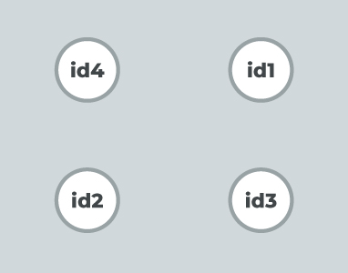
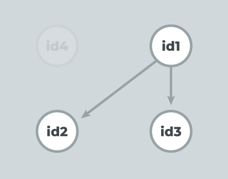
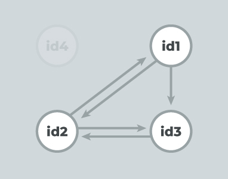

# GD Graph

gd_graph is a simple tool for managing a directed graph and includes some nice features that help to manage the data:

1. The data store is immutable and functional so side effects aren't a problem.
2. The interface is entirely functional and has some useful introspection tools like 'has()', 'connected()', 'degree()'
3. Generates and manages unique ids for all nodes across multiple graphs. Create as many graphs as you'd like and it won't create possible node id conflicts.
4. No dependencies. This is intended to be simple and generic with minimal assumption about how it will be used. Possible uses are: scene graphs, games, logic models, data visualization, etc. gd_graph is intended to simplify some of the underlying logic associated with that type of data architecture.
5. Small and lightweight.

## Install
```
    npm install --save gd_graph
```

## Tests
```
    npm test
```

##  Importing
```
    import graph from "gd_graph" // ES6
    // or
    var graph = require("../gd_graph.es5").default; // ES5
```

## Use



```
    const g = graph()
    
    // add nodes to the graph
    // they start out disconnected
    // returns id's for the nodes
    const id1 = g.add()
    const id2 = g.add()
    const id3 = g.add()
    const id4 = g.add()

    // removes the node and all of its connections
    // cleans up connections from other nodes as well
    g.remove( id4 );
    
    // junk for comparison
    const id4 = "hhdhd9797"
```



```
    // connect directional edge between nodes
    // returns true/false for connection success
    g.connect( id1, id2 ) //true
    g.connect( id1, id3 ) //true
    g.connect( id1, id4 ) //false
```



```
    // bidirectionally connect nodes
    g.connectFull(id2, id3) //[true, true]
    g.connectFull(id1, id2) //[false, true]
    g.connectFull(id1, id4) //[false, false]

    // get a list of all node ids
    // unique ids are generated by the graph
    g.ids() // ["n0", "n1", "n2"]

    // get all the nodes and their edges
    g.nodes() // {n0:[], n1:[], n2:[]}
    
    // does a directional edge
    // connect the first node to the second
    g.connected( id1, id2 ) // true
    g.connected( id1, id3 ) // false
    g.connected( id3, id1 ) // false
    
    // does the graph contain a node with this id?
    g.has( id1 ) // true
    g.has( id4 ) // false

    // get the node's list of edges
    g.get( id1 ) // [ ids... ]
    g.get( id1 ) // [ ids... ]

    // how many connections has id1 formed with other nodes
    // convenience to get the length of the edge list for
    // this node
    g.degree( id1 ) // 3

    // removes the edge from id1 -> id2
    // returns true if the connection is severed
    // returns false if the sever fails
    g.sever( id1, id2 ) // true

    // removes the edge from id2 -> id3 and id3 -> id2
    // returns [true,true] if the connections are severed
    // returns [false, false] if the severs fail
    g.severFull(id2, id3)
```